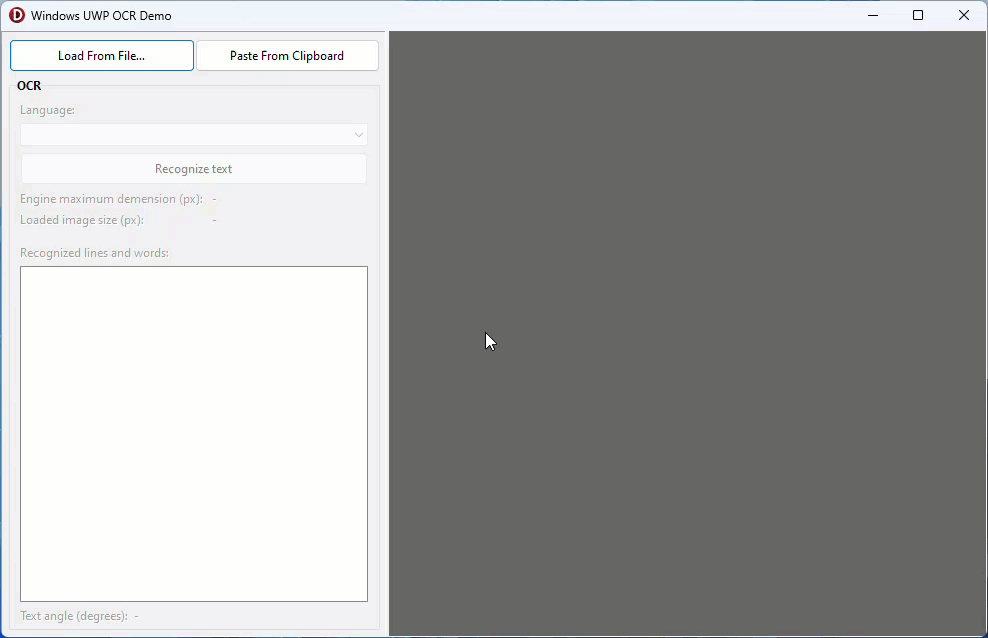
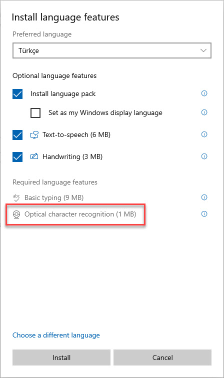

# Delphi UWP OCR
WinRT optical character recognition (OCR) UWP API translations and demo of usage in Delphi applications.

# Supported Languages
To be able to recognize additional languages beside your system language you need to install language pack through the Settings app:

